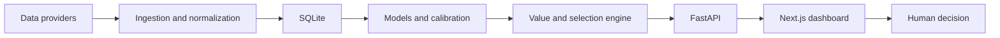

# ValueBot

A full-stack decision-support prototype for exploring football and basketball data, probabilistic models, market comparison, and human-reviewed selections.

The project combines a Python pipeline, FastAPI service, SQLite data layer, and Next.js dashboard. It is designed to make model inputs and uncertainty visible; it does not place bets automatically.

## What it demonstrates

- Multi-source sports-data ingestion and normalization
- Football models including Elo-style ratings, Poisson, and Dixon-Coles components
- A basketball projection path
- Probability calibration and walk-forward evaluation utilities
- Expected-value and stake-sizing experiments
- FastAPI endpoints for fixtures, match analysis, generated slips, results, and health
- A responsive Next.js dashboard
- Docker and hosted-service configuration
- Optional natural-language intent parsing with a deterministic fallback



## Repository map

| Path | Purpose |
|---|---|
| `src/ingest/` | Provider adapters and team mapping |
| `src/models/` | Football and basketball model components |
| `src/backtest/` | Walk-forward and validation utilities |
| `src/value/` | Probability-to-market comparison |
| `src/pipeline/` | Daily orchestration |
| `api/` | FastAPI application |
| `dashboard/` | Next.js interface |
| `docs/` | Architecture, operations, and deployment notes |

## Run locally

```bash
git clone https://github.com/louisoddie999/valuebot.git
cd valuebot
python -m venv .venv
.venv\Scripts\activate
python -m pip install -r requirements-api.txt
python -m uvicorn api.main:app --reload --port 8000
```

In a second terminal:

```bash
cd dashboard
npm install
npm run dev
```

Provider-specific ingestion requires your own credentials and a review of the provider's current terms, quotas, and schemas.

## Evidence boundaries

- The public API reports live calibration only from locally settled records.
- Precomputed headline accuracy or profitability numbers are not bundled as claims.
- Configuration values are experimental thresholds, not proof of real-world performance.
- The included data is for development and interface testing; refresh it before analysis.
- Every output remains a decision aid for human review.

## Responsible use

Model probabilities can be wrong, historical relationships can drift, and positive expected value does not guarantee profit. This repository is for engineering and research. Follow applicable laws, use legally obtained data, and seek help if gambling becomes harmful.

## Author

[Louis Odiatu](https://www.linkedin.com/in/louis-odiatu) — AI Automation & Product Engineer
